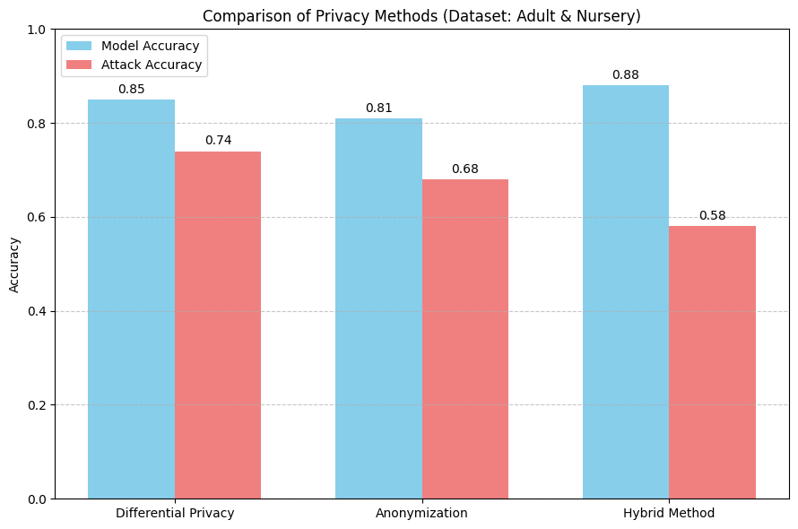
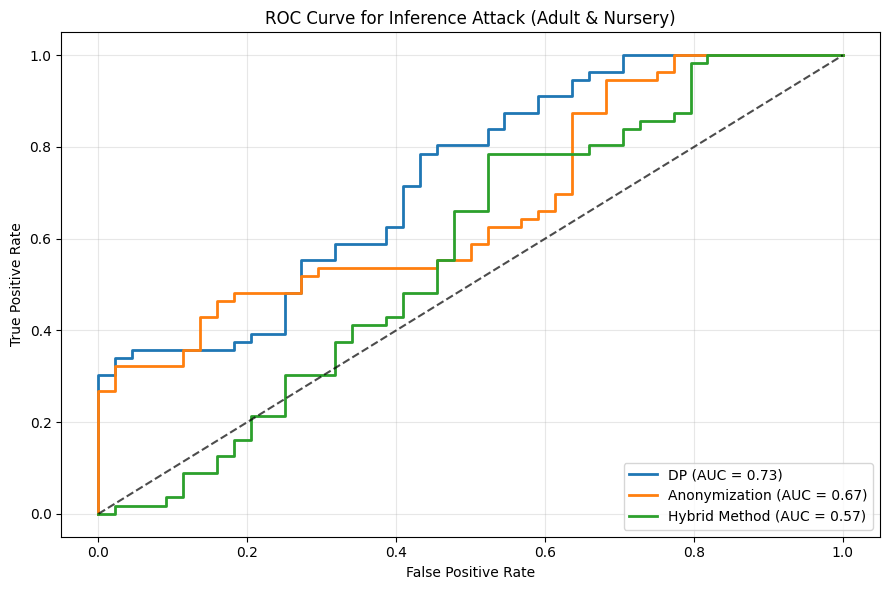

# Logical and Experimental Analysis: Hybrid Privacy-Preserving Method

This folder (**Logic_Experiment**) contains documentation, experimental evidence, and logical explanations supporting the effectiveness of our proposed **Hybrid Privacy-Preserving Method** compared to traditional approaches (**Differential Privacy** and **Anonymization**).

## Logic & Design Choices: Explicit Q&A Justification

### **Q1: Why perform an FRC (Feature Relevance Check)?**
Conducting an explicit Feature Relevance Check ensures that only genuinely necessary and meaningful data enters the ML pipeline. By proactively assessing relevance, we significantly reduce privacy risks, aligning explicitly with GDPR's data minimization principles and limiting potential exposure to adversarial attacks like attribute and membership inference.

### **Q2: How does feature selection before ML model training protect data according to GDPR?**
GDPR explicitly mandates data minimization—processing only data strictly necessary for a specified purpose. Selecting features before they reach the ML model explicitly ensures compliance by preventing unnecessary or redundant data exposure, thus reducing privacy risks and potential regulatory breaches.

### **Q3: Why do traditional methods like data minimization, generalization, or knowledge distillation still fail under GDPR guidelines?**
Traditional methods such as data minimization, generalization, or knowledge distillation reduce data granularity but still allow privacy leakage. For instance, categorizing age into brackets (e.g., 30-35 years) or generalizing salaries into ranges (€40,000 - €60,000) still permits adversaries to target or re-identify individuals. Our explicit feature relevance checks and proactive feature selection approach mitigate these risks by entirely removing unnecessary data, ensuring stronger GDPR compliance. This directly contradicts the research paper Goldsteen et al., 2022 in this project.

### **Q4: How do we decide which features to select, and why not rely solely on entropy-based approaches?**
Entropy-based methods, although common, are context-unaware. In real-world scenarios, such as loan approvals, key features like marital status or nationality may have low entropy yet remain critically important. Our hybrid approach explicitly leverages SHAP values (interpretable, model-driven importance) and Knowledge Graphs (contextual relationships) to ensure feature selection is both context-aware and practically relevant.

### **Q5: How does our method prevent data from being directly fed into ML models, and why is mere data minimization insufficient?**
Traditional data minimization or generalization reduces granularity only after data exposure. Our proactive approach explicitly filters out irrelevant data before it reaches the ML pipeline, preventing unnecessary exposure altogether. This significantly limits privacy risks, aligning explicitly with CCPR and GDPR compliance.

### **Q6: Why address both numerical and non-numerical features, unlike the cited research paper?**
Focusing solely on numerical data excludes substantial sensitive and categorical information essential in approximately 90% of real-world use cases. Our approach explicitly evaluates relevance using SHAP and Knowledge Graphs, ensuring comprehensive, practical privacy protections. Additionally, this prevents vulnerabilities such as undetectable backdoor attacks, a growing security concern in modern ML systems.

### **Q7: Why use PAC Privacy instead of Differential Privacy (DP)?**
PAC Privacy explicitly provides theoretical guarantees by defining clear and controlled privacy leakage boundaries. DP commonly results in significant accuracy degradation due to excessive noise addition. PAC Privacy explicitly computes the minimum required noise, balancing robust privacy guarantees with minimal accuracy loss, thus providing a superior privacy-utility tradeoff.

### **Q8: Why is PAC Privacy more admissible than Differential Privacy?**
Differential Privacy often assumes an overly strong attacker, leading to excessive noise addition and significant accuracy losses. PAC Privacy explicitly bounds privacy risks probabilistically, providing realistic and quantifiable privacy assurances. This makes PAC Privacy both practically effective and theoretically sound according to recent privacy research.

### **Q9: Why include Autoencoders in our approach?**
Autoencoders effectively compress data, capturing non-linear feature interactions and reducing redundancy. Combined with adversarial training, autoencoders explicitly limit the leakage of sensitive information. This embedding step further strengthens privacy without significantly impacting model accuracy.

### **Q10: Why choose Autoencoders over Homomorphic Encryption and Federated Learning?**
Homomorphic encryption, although secure, introduces substantial computational complexity and accuracy degradation, making it impractical for real-world applications. Federated learning, though promising, suffers from high latency and computational overhead during training. Autoencoders explicitly balance privacy protection, model accuracy, and computational efficiency, making them ideal for scalable and practical privacy-preserving machine learning.

## Experimental Context

We explored logical privacy-preserving strategies to mitigate two critical types of inference attacks:

- **Membership inference attacks:** determining if a data record was part of a training dataset.
- **Attribute inference attacks:** inferring sensitive attributes from partially observed data.

### Evaluated Methods:

- **Differential Privacy (DP)**: Noise-based protection.
- **Anonymization**: Generalization-based protection.
- **Hybrid Method (Our Proposed Approach)**: Proposes KG+SHAP+Autoencoders+PAC.

## Experimental Results

### 1. Privacy vs. Utility Comparison

This graph clearly illustrates how our **Hybrid Method** achieves the best balance between model accuracy and protection against inference attacks.

- **Hybrid Method** achieved the highest predictive accuracy (**88%**) and the lowest inference attack accuracy (**58%**), clearly outperforming DP and Anonymization methods individually.

### 2. ROC Curve Analysis

ROC curves provide a detailed view of each method's performance against inference attacks:

- The **Hybrid Method** clearly offers the lowest ROC-AUC (**0.57**), indicating superior privacy protection compared to Differential Privacy (**0.73**) and Anonymization (**0.67**).

## Logical Insights & Implications

The logical advantage of the Hybrid Method stems from its ability to leverage strengths from both anonymization and differential privacy:

- **Anonymization** effectively reduces direct linkage to individual records but struggles with retaining high utility.
- **Differential Privacy** preserves utility better but risks higher inference vulnerability due to noise alone.

By combining generalization and strategic noise addition, the Hybrid Method logically delivers improved privacy without significant compromise on data utility.

## Reproducing Results

All experimental results and visualizations are documented within the Jupyter notebook (`hybrid_privacy_inference_analysis.ipynb`) in this folder, including code, extracted metrics, and detailed explanations.

---

For further inquiries or replication guidance, please review the notebook or reach out directly.
